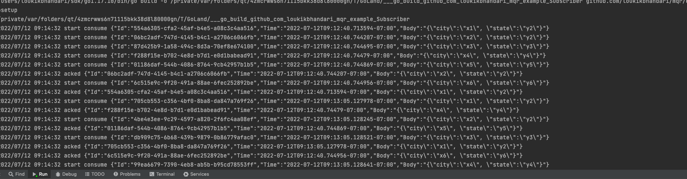
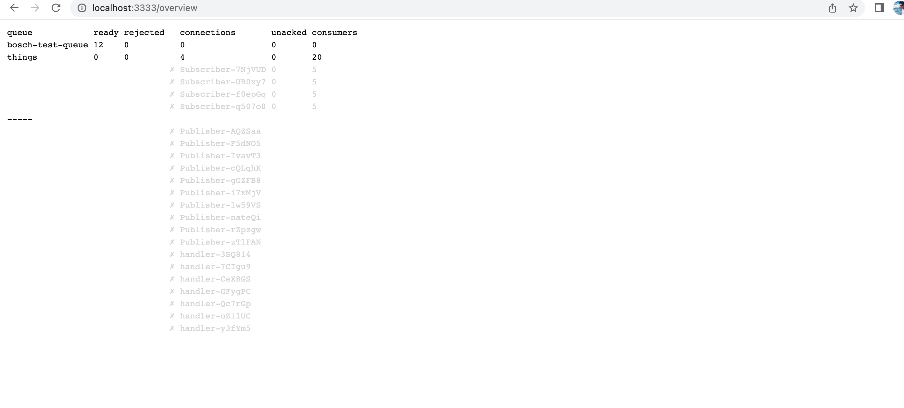

---

## Overview

mqr is short for message queue with redis. It's a message queue system written in Go
and backed by Redis. It is used to support Pub/Sub system


## Basic Usage

Let's take a look at how to use mqr.

### Import

Of course you need to import mqr wherever you want to use it.

```go
import "github.com/loukikbhandari/mqr"
```

### Connection

Before we get to queues, we first need to establish a connection. Each mqr
connection has a name (used in statistics) and Redis connection details
including which Redis database to use. The most basic Redis connection uses a
TCP connection to a given host and a port:

```go
connection, err := mqr.OpenConnection("my service", "tcp", "localhost:6379", 1, errChan)
```

If the Redis instance can't be reached you will receive an error indicating this.

Please also note the `errChan` parameter. There is some mqr logic running in
the background which can run into Redis errors. If you pass an error channel to
the `OpenConnection()` functions mqr will send those background errors to this
channel so you can handle them asynchronously. For more details about this and
handling suggestions see the section about handling background errors below.

### Queues

Once we have a connection we can use it to finally access queues. Each queue
must have a unique name by which we address it. Queues are created once they
are accessed. There is no need to declare them in advance. Here we open a queue
named "tasks":

```go
taskQueue, err := connection.OpenQueue("tasks")
```

Again, possibly Redis errors might be returned.

### Publishers

An empty queue is boring, let's add some deliveries! Internally all deliveries
are saved to Redis lists as strings. This is how you can publish a string
payload to a queue:

```go
delivery := "sample task payload"
err := TaskQueue.Publish(delivery)
```

In practice, we need to send a message with some string along with an identifuer. Assuming `task` is of some type like `Task`, this
is how to publish the JSON representation of that task:

```go
// create task
taskBytes, err := json.Marshal(task)
if err != nil {
    // handle error
}

err = taskQueue.PublishBytes(taskBytes)
```

For a full example see [`example/producer`][producer.go].

[producer.go]: example/producer/main.go

### Subscribers aka consumers 

Now that our queue starts filling, let's add a consumer. After opening the
queue as before, we need it to start consuming before we can add consumers.

```go
err := taskQueue.StartConsuming(10, time.Second)
```

This sets the prefetch limit to 10 and the poll duration to one second. This
means the queue will fetch up to 10 deliveries at a time before giving them to
the consumers.

Once this is set up, we can actually add consumers to the consuming queue.

```go
taskConsumer := &TaskConsumer{}
name, err := taskQueue.AddConsumer("task-Subscriber", taskConsumer)
```

To uniquely identify each consumer internally mqr creates a random name with
the given prefix. For example in this case `name` might be
`task-consumer-WB1zaq`. This name is only used in statistics. 

In our example above the injected `taskConsumer` (of type `*TaskConsumer`) must
implement the `mqr.Consumer` interface. For example:

```go
func (consumer *TaskConsumer) Consume(delivery mqr.Delivery) {
    var task Task
    if err = json.Unmarshal([]byte(delivery.Payload()), &task); err != nil {
        // handle json error
        if err := delivery.Reject(); err != nil {
            // handle reject error
        }
        return
    }

    // perform task
    log.Printf("performing task %s", task)
    if err := delivery.Ack(); err != nil {
        // handle ack error
    }
}
```

First we unmarshal the JSON package found in the delivery payload. If this
fails we reject the delivery. Otherwise we perform the task and ack the
delivery.

If you don't actually need a consumer struct you can use `AddConsumerFunc`
instead and pass a consumer function which handles an `mqr.Delivery`:

```go
name, err := taskQueue.AddConsumerFunc(func(delivery mqr.Delivery) {
    // handle delivery and call Ack() or Reject() on it
})
```

Please note that `delivery.Ack()` and similar functions have a built-in retry
mechanism which will block your consumers in some cases. This is because
because failing to acknowledge a delivery is potentially dangerous. For details
see the section about background errors below.

For a full example see [`example/consumer`][consumer.go].

#### Subscriber Lifecycle

As described above you can add consumers to a queue. For each consumer mqr
takes one of the prefetched unacked deliveries from the delivery channel and
passes it to the consumer's `Consume()` function. The next delivery will only
be passed to the same consumer once the prior `Consume()` call returns. So each
consumer will only be consuming a single delivery at any given time.

Furthermore each `Consume()` call is expected to call either `delivery.Ack()`,
`delivery.Reject()` or `delivery.Push()` (see below). If that's not the case
these deliveries will remain unacked and the prefetch goroutine won't make
progress after a while. So make sure you always call exactly one of those
functions in your `Consume()` implementations.

[consumer.go]: example/Subscriber/main.go


### Publisher Tests

Now let's say we want to test the function `publishTask()` that creates a task
and publishes it to a queue from that connection.

```go
// call the function that should publish a task
publishTask(testConn)

// check that the task is published
assert.Equal(t, "task payload", suite.testConn.GetDelivery("tasks", 0))
```

The `assert.Equal` part is from [testify][testify], but it will look similar
for other testing frameworks. Given a `mqr.TestConnection`, we can check the
deliveries that were published to its queues (since the last `Reset()` call)
with `GetDelivery(queueName, index)`. In this case we want to extract the first
(and possibly only) delivery that was published to queue `tasks` and just check
the payload string.

If the payload is JSON again, the unmarshalling and check might look like this:

```go
var task Task
err := json.Unmarshal([]byte(suite.testConn.GetDelivery("tasks", 0)), &task)
assert.NoError(t, err)
assert.NotNil(t, task)
assert.Equal(t, "value", task.Property)
```

If you expect a producer to create multiple deliveries you can use different
indexes to access them all.

```go
assert.Equal(t, "task1", suite.testConn.GetDelivery("tasks", 0))
assert.Equal(t, "task2", suite.testConn.GetDelivery("tasks", 1))
```

For convenience there's also a function `GetDeliveries` that returns all
published deliveries to a queue as string array.

```go
assert.Equal(t, []string{"task1", "task2"}, suite.testConn.GetDeliveries("tasks"))
```

These examples assume that you inject the `mqr.Connection` into your testable
functions. If you inject instances of `mqr.Queue` instead, you can use
`mqr.TestQueue` instances in tests and access their `LastDeliveries` (since
`Reset()`) directly.

[testify]: https://github.com/stretchr/testify

### Consumer Tests

Testing consumers is a bit easier because consumers must implement the
`mqr.Consumer` interface. In the tests just create an `mqr.TestDelivery` and
pass it to your `Consume()` function. This example creates a test delivery from
a string and then checks that the delivery was acked.

```go
consumer := &TaskConsumer{}
delivery := mqr.NewTestDeliveryString("task payload")

consumer.Consume(delivery)

assert.Equal(t, mqr.Acked, delivery.State)
```

The `State` field will always be one of these values:

- `mqr.Acked`: The delivery was acked
- `mqr.Rejected`: The delivery was rejected
- `mqr.Pushed`: The delivery was pushed (see below)
- `mqr.Unacked`: Nothing of the above

If your packages are JSON marshalled objects, then you can create test
deliveries out of those like this:

```go
task := Task{Property: "bad value"}
delivery := mqr.NewTestDelivery(task)
```


## Publisher aka Feeder


[publisher.go]: example/handler/publisher.go


## Subscriber aka consumers




[subsciber.go]: example/handler/subscriber.go


## Statistics

Given a connection, you can call `connection.CollectStats()` to receive
`mqr.Stats` about all open queues, connections and consumers. If you run
[`example/handler`][handler.go] you can see what's available:



In this example you see  connections consuming `bosch-test-queue`, each 

[handler.go]: example/handler/main.go

