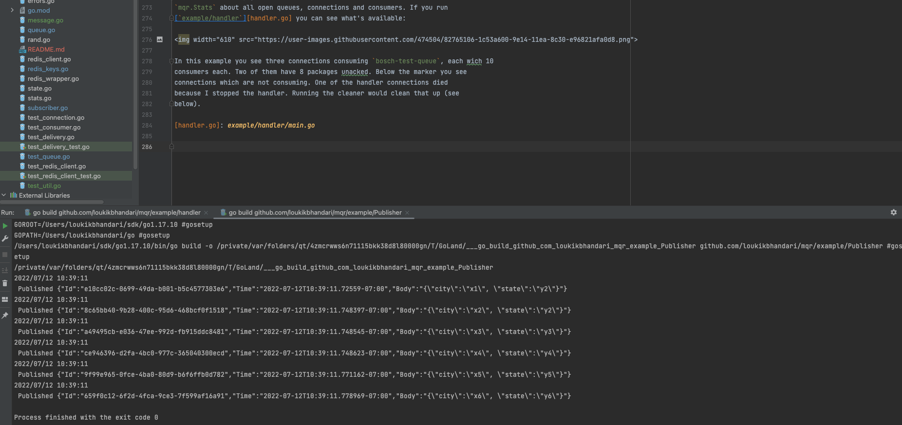

---

## Overview

mqr is short for message queue with redis. It's a message queue system written in Go
and backed by Redis. It is used to support Pub/Sub system


## Basic Usage

Let's take a look at how to use mqr.

### Import

Of course you need to import mqr wherever you want to use it.

```go
import "github.com/loukikbhandari/mqr"
```

### Connection

Before we get to queues, we first need to establish a connection. Each mqr
connection has a name (used in statistics) and Redis connection details
including which Redis database to use. The most basic Redis connection uses a
TCP connection to a given host and a port:

```go
connection, err := mqr.OpenConnection("my service", "tcp", "localhost:6379", 1, errChan)
```

If the Redis instance can't be reached you will receive an error indicating this.

Please also note the `errChan` parameter. There is some mqr logic running in
the background which can run into Redis errors. 

### Queues

Once we have a connection we can use it to finally access queues. Each queue
must have a unique name by which we address it. Queues are created once they
are accessed. There is no need to declare them in advance. Here we open a queue
named "tasks":

```go
taskQueue, err := connection.OpenQueue("tasks")
```

Again, possibly Redis errors might be returned.

### Publishers

An empty queue is boring, let's add some deliveries! Internally all deliveries
are saved to Redis lists as strings. This is how you can publish a string
payload to a queue:

```go
delivery := "sample task payload"
err := TaskQueue.Publish(delivery)
```

In practice, we need to send a message with some string along with an identifuer. Assuming `task` is of some type like `Task`, this
is how to publish the JSON representation of that task:

```go
// create task
taskBytes, err := json.Marshal(task)
if err != nil {
    // handle error
}

err = taskQueue.PublishBytes(taskBytes)
```

For a full example see [`example/publisher`][publisher.go].

[producer.go]: example/publisher/main.go

### Subscribers aka consumers 

Now that our queue starts filling, let's add a consumer. After opening the
queue as before, we need it to start consuming before we can add consumers.

```go
err := taskQueue.StartConsuming(10, time.Second)
```

Once this is set up, we can actually add subscribers to the consuming queue.

```go
taskSubscriber := &TaskSubscriber{}
name, err := taskQueue.AddSubscriber("task-Subscriber", taskSubscriber)
```

To uniquely identify each consumer internally mqr creates a random name with
the given prefix. For example in this case `name` might be
`task-subscriber-WB1zaq`. This name is only used in statistics. 

In our example above the injected `taskSubscriber` (of type `*TaskSubscriber`) must
implement the `mqr.Consumer` interface. For example:

```go
func (consumer *TaskConsumer) Consume(delivery mqr.Delivery) {
    var task Task
    if err = json.Unmarshal([]byte(delivery.Payload()), &task); err != nil {
        // handle json error
        if err := delivery.Reject(); err != nil {
            // handle reject error
        }
        return
    }

    // perform task
    log.Printf("performing task %s", task)
    if err := delivery.Ack(); err != nil {
        // handle ack error
    }
}
```

First we unmarshal the JSON package found in the delivery payload. If this
fails we reject the delivery. Otherwise we perform the task and ack the
delivery.


For a full example see [`example/subscriber`][subscriber.go].

#### Subscriber Lifecycle

As described above you can add consumers to a queue. For each consumer mqr
takes one of the prefetched unacked deliveries from the delivery channel and
passes it to the consumer's `Consume()` function. The next delivery will only
be passed to the same consumer once the prior `Consume()` call returns. So each
consumer will only be consuming a single delivery at any given time.


[subscriber.go]: example/Subscriber/main.go


## Publisher aka Feeder





[publisher.go]: example/handler/publisher.go


## Subscriber aka consumers


[subsciber.go]: example/handler/subscriber.go


## Statistics

Given a connection, you can call `connection.CollectStats()` to receive
`mqr.Stats` about all open queues, connections and consumers. If you run
[`example/handler`][handler.go] you can see what's available:


In this example you see  connections consuming `bosch-test-queue`, each 

[handler.go]: example/handler/main.go

